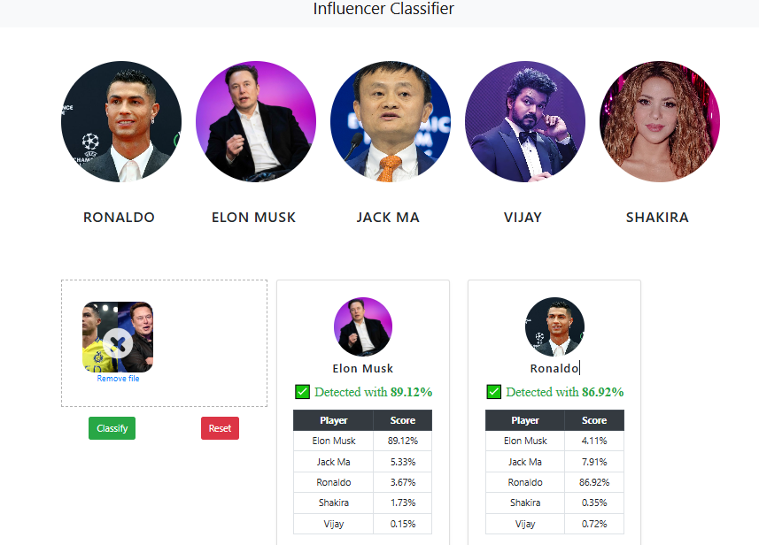

<<<<<<< HEAD

=======

>>>>>>> 45c30addd0656d2c3b23754c75ac678c72e9f108

In this data science and machine learning project, we classify among influencers. We restrict classification to only 5 people. Here, we set the threshold to 50% and higher scores for recognition.
1) Ronaldo
2) Elon Musk
3) Jack Ma
4) Vijay
5) Shakira

Here is the folder structure,
* UI : This contains ui website code 
* server: Python flask server
* model: Contains Dataset and python notebook for model building

Project Workflow
* Data set preparation using Fatkun Batch Download Extension
* Data Cleaning using numpy and opencv
* Model building using sklearn and evaluation using GridSearchCV
* Building Flask server API
* Creating Web Application
* Testing with single person and multiple people images

Technologies used in this project,
1. Python
2. Numpy and OpenCV for data cleaning
3. Matplotlib & Seaborn for data visualization
4. Sklearn for model building
5. Jupyter notebook, visual studio code and pycharm as IDE
6. Python flask for http server
7. HTML/CSS/Javascript for UI

Special Thank to Dhaval Patel, founder of CodeBasic for the awesome reference tutorials.
